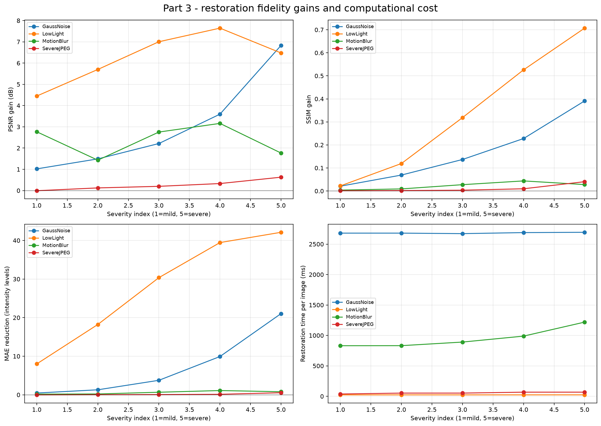

# Cityscapes Image Processing and Vision Robustness

This course project studies how classical and deep-learning vision methods behave when urban street images are degraded. It measures clean-image performance, applies controlled distortions, tests restoration methods, and prepares a distortion-aware YOLO fine-tuning experiment.

The implementation uses the Cityscapes dataset, deterministic experiments, ground-truth semantic and instance annotations, and reproducible CSV/JSON outputs. GPU acceleration is used for YOLO and SegFormer through PyTorch; the classical OpenCV pipeline remains on the CPU.

> **Current result status:** the repository includes 125-image results for all four parts. Part 3 is the final recipe-v3 experiment on official Cityscapes data. Part 4 includes a 20-epoch checkpoint trained on 1,000 images and validated on 125; both remain intermediate relative to the full 500-image evaluation and 2,975-image training split.

## Project overview

The project has three experimental stages containing four numbered parts:

| Stage | Course part | Purpose |
|---|---:|---|
| Clean baselines | Part 1 | Evaluate ORB, Canny, SegFormer-B0, and YOLOv8n on clean Cityscapes validation images |
| Degradation and recovery | Parts 2-3 | Measure robustness under four distortions, apply restoration, and measure whether vision performance recovers |
| Robust adaptation | Part 4 | Fine-tune YOLO on a deterministic mixture of clean and distorted Cityscapes images and compare it with the pretrained detector |

Canny edge detection and motion blur are the additional methods included for the three-person project direction.

## Vision tasks and metrics

| Task | Method | Main metrics |
|---|---|---|
| Local feature detection and matching | ORB | keypoint retention, match retention, spatial inlier ratio |
| Edge detection | Canny | edge-pixel retention, tolerant precision, recall, F1 |
| Semantic segmentation | SegFormer-B0 trained on Cityscapes | per-class IoU, mean IoU, pixel accuracy, mean class accuracy |
| Object detection | YOLOv8n | AP@0.50, mAP@0.50:0.95, precision, recall, matched-box IoU |
| Image quality | SNR, PSNR, SSIM, MAE | paired per-image fidelity before and after restoration |

Cityscapes instance masks are converted to visible object bounding boxes. Detection evaluation uses the seven direct Cityscapes/COCO class matches: `person`, `bicycle`, `car`, `motorcycle`, `bus`, `train`, and `truck`. The Cityscapes `rider` class is excluded because COCO does not have a direct equivalent.

## Methods

### Distortions

| Distortion | Five default levels | Interpretation |
|---|---|---|
| Gaussian noise | sigma 5, 10, 20, 35, 50 | larger sigma means stronger additive noise |
| JPEG compression | quality 80, 60, 40, 20, 5 | lower quality means stronger compression artifacts |
| Low light | factor 0.80, 0.60, 0.40, 0.25, 0.10 | lower factor means a darker image |
| Motion blur | kernel 3, 5, 9, 15, 25 | larger kernel means stronger horizontal blur |

### Restoration

| Distortion | Part 3 restoration method |
|---|---|
| Gaussian noise | severity-aware colored non-local means with conservative mild-level blending and severe-level bilateral residual cleanup |
| JPEG compression | 8x8 boundary-aware luminance deblocking that preserves texture away from JPEG block boundaries |
| Low light | severity-scaled gamma lifting and CLAHE, blended conservatively at mild levels |
| Motion blur | known-PSF Tikhonov deconvolution with a Laplacian smoothness prior and reflected-border handling |

Restoration recipe version 3 is based on classical methods covered by the course and their primary literature: [non-local means](https://doi.org/10.1109/CVPR.2005.38), [signal-adaptive JPEG deblocking](https://doi.org/10.1109/83.661000), [CLAHE](https://doi.org/10.1016/0734-189X(87)90186-X), and [Tikhonov regularization](https://doi.org/10.2307/2006224). Parameters are deterministic functions of the declared synthetic severity and are not fitted on the validation images.

Part 3 is a paired experiment: the distorted and restored measurements use the same Cityscapes image, annotation, and distortion seed. In addition to aggregate ORB, Canny, SegFormer, and YOLO results, it records per-image PSNR, luminance SSIM, MAE, runtime, and restoration parameters. A deterministic paired bootstrap reports the mean improvement, median improvement, 95% confidence interval, win rate, and tie rate for every image-level metric. Negative gains remain visible rather than being filtered out.

The detection evaluator is versioned. Version 2 matches each prediction to the highest-IoU *available* ground-truth box, fixing the crowded-object case in which the global best box was already claimed. When Part 2 results are reused, Part 3 reuses only validated ORB, Canny, and SegFormer baselines and recomputes distorted YOLO predictions so both detection conditions use evaluator version 2.

## Results: 125-image validation run

Parts 1, 2, and 4 use the peer's seed-`7` run under [`outputs_big_125/`](outputs_big_125/); Part 4 trained on 1,000 images for 20 epochs. Part 3 uses the same 125 evaluation IDs in a separate official-data run with the corrected evaluator and expanded statistical outputs.

### Part 1: clean baselines

| Metric | Result |
|---|---:|
| SegFormer mean IoU | 0.5827 |
| SegFormer pixel accuracy | 0.9212 |
| YOLO mAP@0.50:0.95 | 0.1762 |
| YOLO mAP@0.50 | 0.2916 |
| YOLO recall@0.50 | 0.4792 |

The larger sample contains 2,214 ground-truth objects and all seven shared detection classes. Its detection baseline is lower than the earlier 20-image value because the new sample is more diverse and includes rare classes that were absent or represented by only a few objects in the smoke run.


### Part 2: distortion robustness

The table shows the strongest tested level of each distortion. ORB and Canny values are retention/F1 relative to the corresponding clean images.

| Condition | ORB match retention | Canny F1 | Segmentation mIoU | Detection mAP@0.50:0.95 |
|---|---:|---:|---:|---:|
| Clean | 1.0000 | 1.0000 | 0.5827 | 0.1762 |
| Gaussian noise, sigma 50 | 0.4284 | 0.7715 | 0.4201 | 0.0297 |
| JPEG, quality 5 | 0.4448 | 0.8351 | 0.3202 | 0.1069 |
| Low light, factor 0.10 | 0.0000 | 0.0000 | 0.5069 | 0.0953 |
| Motion blur, kernel 25 | 0.0269 | 0.1065 | 0.4876 | 0.0870 |

The results expose different failure modes: low light and motion blur strongly affect classical features, while severe noise and JPEG compression cause the largest segmentation and detection losses.


### Part 3: restoration

The final Part 3 run used seed `7`, 125 official validation images, all 20 distortion/severity variants, recipe version 3, and detection evaluator version 2. Matching Part 2 ORB, Canny, and SegFormer baselines were reused; image-quality metrics and both distorted/restored YOLO predictions were recomputed. The run completed in 67 minutes.

| Strongest condition | PSNR gain | SSIM gain | Segmentation mIoU gain | Detection mAP gain |
|---|---:|---:|---:|---:|
| Gaussian noise, sigma 50 | +6.832 dB | +0.391 | -0.0135 | +0.0420 |
| JPEG, quality 5 | +0.629 dB | +0.040 | +0.0188 | +0.0050 |
| Low light, factor 0.10 | +6.476 dB | +0.707 | +0.0297 | +0.0684 |
| Motion blur, kernel 25 | +1.766 dB | +0.028 | -0.0240 | +0.0293 |

SSIM improved in all 20 variants, PSNR and MAE improved in 19, and detection mAP improved in 17. Canny improved in 14 variants, while segmentation improved in 9: restoration reliably improved visual fidelity and usually detection, but some denoising/deblurring removed cues useful to ORB, Canny, or SegFormer. Paired bootstrap confidence intervals and win rates are reported for every image-level metric.




### Part 4: distortion-aware fine-tuning

The 1,000-image, 20-epoch fine-tuning run preserved clean performance and improved robustness under most distortions:

| Comparison | Pretrained | Fine-tuned | Change |
|---|---:|---:|---:|
| Clean mAP@0.50:0.95 | 0.1762 | 0.1766 | +0.0004 |
| Mean distorted mAP@0.50:0.95 | 0.1415 | 0.1567 | +0.0152 |

The relative improvement in mean distorted mAP is approximately 10.8%, and 17 of 20 distorted conditions improved. The largest gains occurred for Gaussian noise sigma 50 (+0.0542), Gaussian noise sigma 35 (+0.0443), low light factor 0.10 (+0.0412), and motion blur kernel 25 (+0.0378). Small regressions remained for Gaussian noise sigma 5 and JPEG qualities 60 and 40, showing the expected trade-off between severe-distortion robustness and mild-condition performance.


## Dataset

The project needs the full-resolution Cityscapes images and fine annotations, including
the instance-ID masks used to derive object-detection ground truth. Two acquisition
routes are known:

- Official: download `leftImg8bit_trainvaltest.zip` and `gtFine_trainvaltest.zip`
  after accepting the terms on the [Cityscapes website](https://www.cityscapes-dataset.com/).
- Optional public mirror: download the full
  [`kavithak1388/cityscapes` archive from Kaggle](https://www.kaggle.com/datasets/kavithak1388/cityscapes).
  This mirror extracts to a directory named `Cityscape`; rename it to `cityscapes`.
  The mirror does not declare a Kaggle license, so the original Cityscapes
  non-commercial terms still need to be respected.

Whichever route is used, place the extracted files under one dataset root:

```text
data/cityscapes/
|-- leftImg8bit/
|   |-- train/<city>/*_leftImg8bit.png
|   `-- val/<city>/*_leftImg8bit.png
`-- gtFine/
    |-- train/<city>/*_gtFine_labelIds.png
    |                    *_gtFine_instanceIds.png
    `-- val/<city>/*_gtFine_labelIds.png
                         *_gtFine_instanceIds.png
```

Raw Cityscapes `labelIds` are converted in memory to the 19 training IDs. Existing `labelTrainIds` files also work. Reported evaluation scores should use `val`; Cityscapes test annotations are withheld.

## Installation

Python 3.10 or newer is recommended. From PowerShell in the repository root:

```powershell
python -m venv .venv
.\.venv\Scripts\Activate.ps1
python -m pip install --upgrade pip
python -m pip install -r requirements.txt
```

### NVIDIA CUDA setup

```powershell
powershell -ExecutionPolicy Bypass -File .\setup_cuda.ps1
python -c "import torch; print(torch.__version__); print(torch.cuda.is_available()); print(torch.cuda.get_device_name(0))"
```

The first model run downloads the pretrained weights `yolov8n.pt` and
`nvidia/segformer-b0-finetuned-cityscapes-1024-1024`. These are model weights only;
they do not contain the Cityscapes dataset described above.

Use `--device cuda` for GPU inference and training, `--device cuda:0` to select a GPU, or `--device cpu` for CPU execution. CUDA half precision is enabled by default; use `--no-half` if the GPU does not support it reliably.

CuPy is intentionally not required. Gaussian noise generation is inexpensive compared with model inference, and transferring full-resolution images between NumPy and CuPy would add overhead. YOLO and SegFormer already remain on the GPU through PyTorch.

## Running the project

All commands are run from the repository root. The entry point accepts `--part 1`, `2`, `3`, `4`, or `all`.

### Quick end-to-end smoke test

This uses four evaluation images, two distortion levels, one Part 4 epoch, and small training limits:

```powershell
python .\main.py `
  --dataset-root .\data\cityscapes `
  --output-dir .\outputs_quick `
  --artifacts-dir .\artifacts `
  --part all `
  --quick `
  --device cuda
```

### Run each part separately

```powershell
python .\main.py --dataset-root .\data\cityscapes --output-dir .\outputs --part 1 --device cuda
python .\main.py --dataset-root .\data\cityscapes --output-dir .\outputs --part 2 --device cuda
python .\main.py --dataset-root .\data\cityscapes --output-dir .\outputs --part 3 --device cuda
python .\main.py --dataset-root .\data\cityscapes --output-dir .\outputs --artifacts-dir .\artifacts --part 4 --device cuda
```

Part 2 automatically computes the clean Part 1 references it needs.

### Run the complete experiment

Omitting `--max-samples` uses all 500 validation images. Part 4 defaults to all 2,975 Cityscapes training images, all 500 validation images, and 20 epochs.

```powershell
python .\main.py `
  --dataset-root .\data\cityscapes `
  --output-dir .\outputs_final `
  --artifacts-dir .\artifacts `
  --part all `
  --device cuda
```

The full pipeline is long. Running the parts separately is safer. Each completed severity variant is checkpointed, Part 3 reuses structurally complete, exactly matching Part 2 ORB/Canny/SegFormer baselines by default, and prepared Part 4 data is cached. Part 3 always recomputes distorted detection for evaluator consistency. Use `--no-reuse-part2` only for an independent recomputation of every distorted baseline.

### Evaluate an existing fine-tuned checkpoint

```powershell
python .\main.py `
  --dataset-root .\data\cityscapes `
  --output-dir .\outputs_part4 `
  --part 4 `
  --device cuda `
  --fine-tuned-weights .\artifacts\part4\training_runs\<run-name>\weights\best.pt
```

## Main configuration options

| Option | Default | Meaning |
|---|---:|---|
| `--part` | `all` | Run one numbered part or the complete pipeline |
| `--split` | `val` | Cityscapes evaluation split |
| `--max-samples` | `0` | Deterministic evaluation limit; `0` means all 500 validation images |
| `--seed` | `7` | Sampling, distortion, assignment, and training seed |
| `--device` | `auto` | `auto`, `cpu`, `cuda`, `cuda:0`, or `mps` |
| `--no-half` | off | Disable CUDA half precision |
| `--quick` | off | Use tiny limits for a smoke test |
| `--nfeatures` | `800` | Maximum ORB features per image |
| `--orb-ratio-threshold` | `0.75` | ORB descriptor ratio-test threshold |
| `--orb-spatial-threshold` | `3.0` | Maximum aligned-keypoint distance in pixels |
| `--canny-low-threshold` | `100` | Lower Canny hysteresis threshold |
| `--canny-high-threshold` | `200` | Upper Canny hysteresis threshold |
| `--canny-blur-kernel` | `5` | Positive odd Gaussian pre-blur size |
| `--canny-tolerance-radius` | `2` | Edge-matching tolerance in pixels |
| `--yolo-eval-confidence` | `0.001` | Low confidence floor used to build the precision-recall curve |
| `--yolo-visual-confidence` | `0.25` | Confidence floor used only in gallery figures |
| `--gallery-samples` | `4` | Number of representative gallery samples |
| `--part3-bootstrap-resamples` | `1000` | Deterministic paired bootstrap samples per Part 3 metric and severity |
| `--part3-confidence-level` | `0.95` | Confidence level for paired Part 3 intervals |
| `--part4-train-samples` | `0` | Part 4 training limit; `0` means all 2,975 training images |
| `--part4-val-samples` | `0` | Part 4 validation limit; `0` means all 500 validation images |
| `--part4-epochs` | `20` | YOLO fine-tuning epochs |
| `--part4-image-size` | `640` | YOLO training resolution |
| `--part4-batch` | `8` | Training batch size; reduce it after a CUDA out-of-memory error |
| `--part4-clean-fraction` | `0.20` | Fraction of clean images in the robust training mixture |
| `--rebuild-training-data` | off | Recreate the cached Part 4 training dataset |
| `--no-reuse-part2` | off | Recompute distorted Part 3 baselines instead of reusing a complete matching Part 2 run |

Run `python .\main.py --help` for every available option.

## Output files

Each run records aggregate results, per-image data, per-class metrics, plots, and the full configuration:

```text
outputs/
|-- run_manifest.json
|-- run_manifest_parts_3_4.json
|-- part1/
|   |-- clean_summary.json
|   |-- clean_per_image.csv
|   |-- segmentation_per_class.csv
|   |-- detection_per_class.csv
|   `-- figures/
|-- part2/
|   |-- distorted_summary.json
|   |-- distorted_summary.csv
|   |-- distorted_per_image.csv
|   `-- figures/
|-- part3/
|   |-- restoration_summary.json
|   |-- restoration_summary.csv
|   |-- restoration_per_image.csv
|   |-- paired_statistics.csv
|   |-- restoration_manifest.json
|   `-- figures/
`-- part4/
    |-- fine_tuning_summary.json
    |-- fine_tuning_summary.csv
    |-- detection_per_class.csv
    |-- run_summary.json
    `-- figures/
```

Useful tracked examples from the 125-image run:

- [Part 1 clean summary](outputs_big_125/part1/clean_summary.json)
- [Part 2 aggregate results](outputs_big_125/part2/distorted_summary.csv)
- [Part 2 per-image results](outputs_big_125/part2/distorted_per_image.csv)
- [Part 3 aggregate results](outputs_big_125/part3/restoration_summary.csv)
- [Part 3 per-image results](outputs_big_125/part3/restoration_per_image.csv)
- [Part 3 paired statistics](outputs_big_125/part3/paired_statistics.csv)
- [Part 3 reproducibility manifest](outputs_big_125/part3/restoration_manifest.json)
- [Part 4 fine-tuning results](outputs_big_125/part4/fine_tuning_summary.csv)
- [Complete run configuration](outputs_big_125/run_manifest_parts_3_4.json)
- [Part 3 recipe-v3 run configuration](outputs_part3_v3_125_official/run_manifest_parts_3_4.json)

`outputs_5_images/` and `outputs_20_images/` are smoke tests. `outputs_part3_v3_125_official/` contains the final Part 3 code-compatible results. `incomplete_old_run/` is retained only for provenance and must not be combined with current results.

## Reproducibility and evaluation design

- Sample selection and every synthetic distortion are deterministic under `--seed`.
- SNR is calculated for every evaluated image and then aggregated; plots do not use an unrelated example image for their x-axis.
- Part 3 also records RGB PSNR/MAE and luminance SSIM for complementary fidelity and structure measurements.
- Every image-level Part 3 comparison is paired and includes a deterministic bootstrap confidence interval and win rate.
- Part 2 and Part 3 reuse the same image IDs and distortion seeds for paired comparisons.
- Semantic void label `255` is ignored.
- Detection uses a low confidence floor and 101-point AP interpolation at IoU thresholds 0.50 through 0.95.
- Detection also reports precision, recall, and F1 at confidence `0.25`; the terminal precision from the `0.001` AP floor is retained only for audit compatibility.
- Part 4 uses Cityscapes ground-truth instance masks, not model-generated pseudo-labels.
- Part 4 training and validation images come from separate Cityscapes splits.
- Prepared Part 4 images use PNG so clean and non-JPEG conditions do not acquire unintended JPEG artifacts.
- The Part 4 dataset manifest records class-instance and distortion-condition counts before training.
- Manifests store the configuration and prepared-dataset identity for later auditing.

SNR is computed as:

```text
10 * log10(mean(clean^2) / mean((clean - test)^2))
```

## Repository organization

```text
images_project/
|-- main.py                         # Small unified entry point
|-- cityscapes_project/
|   |-- cli.py                      # Command-line interface
|   |-- config.py                   # Constants and experiment dataclasses
|   |-- dataset.py                  # Discovery, loading, label and box conversion
|   |-- types.py                    # Shared data records
|   |-- methods/
|   |   |-- classical.py            # ORB and Canny
|   |   |-- distortions.py          # Distortions, SNR, deterministic seeds
|   |   |-- restoration.py          # Versioned Part 3 restoration recipes
|   |   |-- quality.py              # PSNR, luminance SSIM, and MAE
|   |   |-- segmentation.py         # SegFormer inference and metrics
|   |   `-- detection.py            # YOLO conversion and AP metrics
|   |-- pipelines/
|   |   |-- parts12.py              # Parts 1 and 2 orchestration
|   |   `-- parts34.py              # Parts 3 and 4 orchestration
|   `-- utils/
|       |-- dependencies.py         # Optional dependency messages
|       |-- device.py               # CUDA/CPU selection and model loading
|       |-- io.py                   # JSON and CSV output
|       |-- timing.py               # Runtime measurement and extrapolation
|       |-- statistics.py           # Deterministic paired bootstrap intervals
|       `-- visualization.py        # Galleries and plots
|-- tests/
|   |-- test_core_methods.py
|   |-- test_restoration_and_training.py
|   `-- test_timing.py
|-- requirements.txt
`-- setup_cuda.ps1
```

## Tests

The tests do not download model weights:

```powershell
python -m unittest discover -s tests -v
```

They cover Cityscapes discovery and label mapping, deterministic distortions, severity-aware restoration, PSNR/SSIM/MAE, paired bootstrap statistics, ORB and Canny support, segmentation metrics, crowded-object detection matching and AP, YOLO label conversion, training-data assignment, runtime extrapolation, and lightweight output creation.

## Runtime estimate

The replacement 125-image Part 3 run took 67 minutes on an RTX 5090 system. The peer's earlier complete 125-image run took 1 hour 57 minutes on an RTX 4060, including approximately 19 minutes for Parts 1-2 and 24 minutes for Part 4. Part 4 training itself took about 3 minutes 23 seconds; multi-condition evaluation dominated its runtime. A 500-image Part 3 run is estimated at roughly 4.5 hours on the RTX 5090 system.

## Assumptions and known limitations

- The tracked 125-image results are substantially more reliable than the smoke runs but still cover only one quarter of the 500-image validation split.
- Part 4 used 1,000 of the 2,975 available training images; the complete training split may change the robustness trade-off.
- Parts 1, 2, and 4 were produced before detection evaluator version 2 and should be audited for strict cross-part consistency.
- Severity-aware restoration can still remove features useful to downstream models; Part 3 therefore reports positive and negative gains.
- The Cityscapes and COCO label spaces are not identical, so only seven direct classes are evaluated.
- Ground-truth detection boxes represent visible instance-mask pixels, not amodal object extents.
- Some shared detection classes may be absent from a small sample; only classes with ground-truth instances contribute to mAP.
- Part 3 remains CPU-heavy, while model inference and training can use CUDA.
