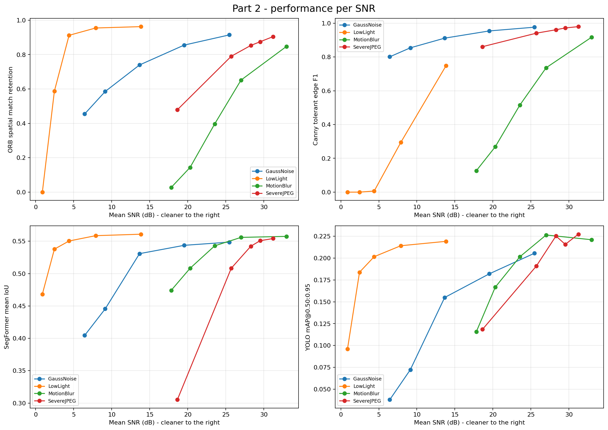
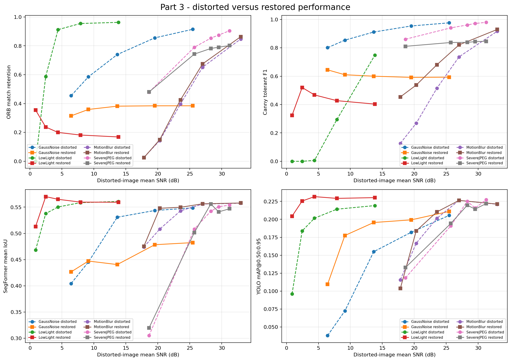

# Cityscapes Image Processing and Vision Robustness

This course project studies how classical and deep-learning vision methods behave when urban street images are degraded. It measures clean-image performance, applies controlled distortions, tests restoration methods, and prepares a distortion-aware YOLO fine-tuning experiment.

The implementation uses the Cityscapes dataset, deterministic experiments, ground-truth semantic and instance annotations, and reproducible CSV/JSON outputs. GPU acceleration is used for YOLO and SegFormer through PyTorch; the classical OpenCV pipeline remains on the CPU.

> **Current result status:** the repository includes a complete 20-image validation run for all four parts. It is useful for checking the pipeline and identifying trends, but it is not the final 500-image benchmark. The included Part 4 checkpoint is an intentionally small smoke test and did not learn a useful detector.

## Project overview

The project has three experimental stages containing four numbered parts:

| Stage | Course part | Purpose |
|---|---:|---|
| Clean baselines | Part 1 | Evaluate ORB, Canny, SegFormer-B0, and YOLOv8n on clean Cityscapes validation images |
| Degradation and recovery | Parts 2-3 | Measure robustness under four distortions, apply restoration, and measure whether vision performance recovers |
| Robust adaptation | Part 4 | Fine-tune YOLO on a deterministic mixture of clean and distorted Cityscapes images and compare it with the pretrained detector |

Canny edge detection and motion blur are the additional methods included for the three-person project direction.

## Vision tasks and metrics

| Task | Method | Main metrics |
|---|---|---|
| Local feature detection and matching | ORB | keypoint retention, match retention, spatial inlier ratio |
| Edge detection | Canny | edge-pixel retention, tolerant precision, recall, F1 |
| Semantic segmentation | SegFormer-B0 trained on Cityscapes | per-class IoU, mean IoU, pixel accuracy, mean class accuracy |
| Object detection | YOLOv8n | AP@0.50, mAP@0.50:0.95, precision, recall, matched-box IoU |
| Image quality | SNR | per-image signal-to-noise ratio before and after restoration |

Cityscapes instance masks are converted to visible object bounding boxes. Detection evaluation uses the seven direct Cityscapes/COCO class matches: `person`, `bicycle`, `car`, `motorcycle`, `bus`, `train`, and `truck`. The Cityscapes `rider` class is excluded because COCO does not have a direct equivalent.

## Methods

### Distortions

| Distortion | Five default levels | Interpretation |
|---|---|---|
| Gaussian noise | sigma 5, 10, 20, 35, 50 | larger sigma means stronger additive noise |
| JPEG compression | quality 80, 60, 40, 20, 5 | lower quality means stronger compression artifacts |
| Low light | factor 0.80, 0.60, 0.40, 0.25, 0.10 | lower factor means a darker image |
| Motion blur | kernel 3, 5, 9, 15, 25 | larger kernel means stronger horizontal blur |

### Restoration

| Distortion | Part 3 restoration method |
|---|---|
| Gaussian noise | severity-scaled colored non-local means; bilateral cleanup only at high sigma |
| JPEG compression | severity-scaled luminance bilateral filtering blended with the input |
| Low light | severity-scaled gamma lifting and CLAHE, blended conservatively at mild levels |
| Motion blur | regularized Wiener deconvolution using the known synthetic motion kernel |

Restoration parameters are deterministic functions of distortion severity. This avoids the strong over-processing seen when one setting was used for every level. Restoration is still evaluated rather than assumed to help: negative SNR or task-metric gains remain in the output.

## Preliminary results: 20-image validation run

These results were generated with seed `7`, all five severity levels, CUDA inference, 20 Cityscapes validation images, and the strict detection metric mAP@0.50:0.95. Raw results are available under [`outputs_20_images/`](outputs_20_images/).

### Part 1: clean baselines

| Metric | Result |
|---|---:|
| SegFormer mean IoU | 0.5586 |
| SegFormer pixel accuracy | 0.9120 |
| YOLO mAP@0.50:0.95 | 0.2252 |
| YOLO mAP@0.50 | 0.4418 |
| YOLO recall@0.50 | 0.5924 |


### Part 2: distortion robustness

The table shows the strongest tested level of each distortion. ORB and Canny values are retention/F1 relative to the corresponding clean images.

| Condition | ORB match retention | Canny F1 | Segmentation mIoU | Detection mAP@0.50:0.95 |
|---|---:|---:|---:|---:|
| Clean | 1.0000 | 1.0000 | 0.5586 | 0.2252 |
| Gaussian noise, sigma 50 | 0.4545 | 0.8011 | 0.4045 | 0.0380 |
| JPEG, quality 5 | 0.4789 | 0.8609 | 0.3052 | 0.1184 |
| Low light, factor 0.10 | 0.0000 | 0.0000 | 0.4682 | 0.0959 |
| Motion blur, kernel 25 | 0.0273 | 0.1267 | 0.4741 | 0.1157 |

The results expose different failure modes: low light and motion blur strongly affect classical features, while severe noise and JPEG compression cause the largest segmentation and detection losses.



### Part 3: restoration

These tracked values came from the earlier fixed-strength smoke test. They motivated the current severity-aware restoration implementation and must not be reused as final Part 3 results.

| Condition | SNR before -> after | Segmentation mIoU before -> after | Detection mAP before -> after |
|---|---:|---:|---:|
| Gaussian noise, sigma 50 | 6.44 -> 17.47 dB | 0.4045 -> 0.4267 | 0.0380 -> 0.1095 |
| JPEG, quality 5 | 18.63 -> 19.30 dB | 0.3052 -> 0.3200 | 0.1184 -> 0.1328 |
| Low light, factor 0.10 | 0.88 -> 9.93 dB | 0.4682 -> 0.5131 | 0.0959 -> 0.2044 |
| Motion blur, kernel 25 | 17.82 -> 17.02 dB | 0.4741 -> 0.4755 | 0.1157 -> 0.1036 |

For example, severe low-light restoration substantially improved image quality, segmentation, and detection. Conversely, the old mild Gaussian setting removed useful detail. The current code scales restoration strength by level; a new final run is required to measure the corrected behavior.



### Part 4: fine-tuning status

The tracked Part 4 run used only 20 training images, 20 validation images, and 5 epochs. Its clean mAP@0.50:0.95 fell from `0.2252` to `0.0004`. This checkpoint is unsuccessful and must not be reported as evidence that robustness fine-tuning works.

The smoke run verifies that data preparation, training, checkpoint loading, and evaluation complete end to end. A valid Part 4 conclusion requires the full training split, a separate validation split, and the default 20-epoch recipe.

## Dataset

Download `leftImg8bit_trainvaltest.zip` and `gtFine_trainvaltest.zip` from the [Cityscapes website](https://www.cityscapes-dataset.com/) and extract them under one dataset root:

```text
data/cityscapes/
|-- leftImg8bit/
|   |-- train/<city>/*_leftImg8bit.png
|   `-- val/<city>/*_leftImg8bit.png
`-- gtFine/
    |-- train/<city>/*_gtFine_labelIds.png
    |                    *_gtFine_instanceIds.png
    `-- val/<city>/*_gtFine_labelIds.png
                         *_gtFine_instanceIds.png
```

Raw Cityscapes `labelIds` are converted in memory to the 19 training IDs. Existing `labelTrainIds` files also work. Reported evaluation scores should use `val`; Cityscapes test annotations are withheld.

## Installation

Python 3.10 or newer is recommended. From PowerShell in the repository root:

```powershell
python -m venv .venv
.\.venv\Scripts\Activate.ps1
python -m pip install --upgrade pip
python -m pip install -r requirements.txt
```

### NVIDIA CUDA setup

```powershell
powershell -ExecutionPolicy Bypass -File .\setup_cuda.ps1
python -c "import torch; print(torch.__version__); print(torch.cuda.is_available()); print(torch.cuda.get_device_name(0))"
```

The first model run downloads `yolov8n.pt` and `nvidia/segformer-b0-finetuned-cityscapes-1024-1024`.

Use `--device cuda` for GPU inference and training, `--device cuda:0` to select a GPU, or `--device cpu` for CPU execution. CUDA half precision is enabled by default; use `--no-half` if the GPU does not support it reliably.

CuPy is intentionally not required. Gaussian noise generation is inexpensive compared with model inference, and transferring full-resolution images between NumPy and CuPy would add overhead. YOLO and SegFormer already remain on the GPU through PyTorch.

## Running the project

All commands are run from the repository root. The entry point accepts `--part 1`, `2`, `3`, `4`, or `all`.

### Quick end-to-end smoke test

This uses four evaluation images, two distortion levels, one Part 4 epoch, and small training limits:

```powershell
python .\main.py `
  --dataset-root .\data\cityscapes `
  --output-dir .\outputs_quick `
  --artifacts-dir .\artifacts `
  --part all `
  --quick `
  --device cuda
```

### Run each part separately

```powershell
python .\main.py --dataset-root .\data\cityscapes --output-dir .\outputs --part 1 --device cuda
python .\main.py --dataset-root .\data\cityscapes --output-dir .\outputs --part 2 --device cuda
python .\main.py --dataset-root .\data\cityscapes --output-dir .\outputs --part 3 --device cuda
python .\main.py --dataset-root .\data\cityscapes --output-dir .\outputs --artifacts-dir .\artifacts --part 4 --device cuda
```

Part 2 automatically computes the clean Part 1 references it needs.

### Run the complete experiment

Omitting `--max-samples` uses all 500 validation images. Part 4 defaults to all 2,975 Cityscapes training images, all 500 validation images, and 20 epochs.

```powershell
python .\main.py `
  --dataset-root .\data\cityscapes `
  --output-dir .\outputs_final `
  --artifacts-dir .\artifacts `
  --part all `
  --device cuda
```

The full pipeline is long. Running the parts separately is safer. Each completed severity variant is checkpointed, Part 3 reuses a complete matching Part 2 baseline by default, and prepared Part 4 data is cached. Use `--no-reuse-part2` only for an independent recomputation.

### Evaluate an existing fine-tuned checkpoint

```powershell
python .\main.py `
  --dataset-root .\data\cityscapes `
  --output-dir .\outputs_part4 `
  --part 4 `
  --device cuda `
  --fine-tuned-weights .\artifacts\part4\training_runs\<run-name>\weights\best.pt
```

## Main configuration options

| Option | Default | Meaning |
|---|---:|---|
| `--part` | `all` | Run one numbered part or the complete pipeline |
| `--split` | `val` | Cityscapes evaluation split |
| `--max-samples` | `0` | Deterministic evaluation limit; `0` means all 500 validation images |
| `--seed` | `7` | Sampling, distortion, assignment, and training seed |
| `--device` | `auto` | `auto`, `cpu`, `cuda`, `cuda:0`, or `mps` |
| `--no-half` | off | Disable CUDA half precision |
| `--quick` | off | Use tiny limits for a smoke test |
| `--nfeatures` | `800` | Maximum ORB features per image |
| `--orb-ratio-threshold` | `0.75` | ORB descriptor ratio-test threshold |
| `--orb-spatial-threshold` | `3.0` | Maximum aligned-keypoint distance in pixels |
| `--canny-low-threshold` | `100` | Lower Canny hysteresis threshold |
| `--canny-high-threshold` | `200` | Upper Canny hysteresis threshold |
| `--canny-blur-kernel` | `5` | Positive odd Gaussian pre-blur size |
| `--canny-tolerance-radius` | `2` | Edge-matching tolerance in pixels |
| `--yolo-eval-confidence` | `0.001` | Low confidence floor used to build the precision-recall curve |
| `--yolo-visual-confidence` | `0.25` | Confidence floor used only in gallery figures |
| `--gallery-samples` | `4` | Number of representative gallery samples |
| `--part4-train-samples` | `0` | Part 4 training limit; `0` means all 2,975 training images |
| `--part4-val-samples` | `0` | Part 4 validation limit; `0` means all 500 validation images |
| `--part4-epochs` | `20` | YOLO fine-tuning epochs |
| `--part4-image-size` | `640` | YOLO training resolution |
| `--part4-batch` | `8` | Training batch size; reduce it after a CUDA out-of-memory error |
| `--part4-clean-fraction` | `0.20` | Fraction of clean images in the robust training mixture |
| `--rebuild-training-data` | off | Recreate the cached Part 4 training dataset |
| `--no-reuse-part2` | off | Recompute distorted Part 3 baselines instead of reusing a complete matching Part 2 run |

Run `python .\main.py --help` for every available option.

## Output files

Each run records aggregate results, per-image data, per-class metrics, plots, and the full configuration:

```text
outputs/
|-- run_manifest.json
|-- run_manifest_parts_3_4.json
|-- part1/
|   |-- clean_summary.json
|   |-- clean_per_image.csv
|   |-- segmentation_per_class.csv
|   |-- detection_per_class.csv
|   `-- figures/
|-- part2/
|   |-- distorted_summary.json
|   |-- distorted_summary.csv
|   |-- distorted_per_image.csv
|   `-- figures/
|-- part3/
|   |-- restoration_summary.json
|   |-- restoration_summary.csv
|   |-- restoration_per_image.csv
|   `-- figures/
`-- part4/
    |-- fine_tuning_summary.json
    |-- fine_tuning_summary.csv
    |-- detection_per_class.csv
    |-- run_summary.json
    `-- figures/
```

Useful tracked examples:

- [Part 1 clean summary](outputs_20_images/part1/clean_summary.json)
- [Part 2 aggregate results](outputs_20_images/part2/distorted_summary.csv)
- [Part 2 per-image results](outputs_20_images/part2/distorted_per_image.csv)
- [Part 3 aggregate results](outputs_20_images/part3/restoration_summary.csv)
- [Part 3 per-image results](outputs_20_images/part3/restoration_per_image.csv)
- [Part 4 smoke-test results](outputs_20_images/part4/fine_tuning_summary.csv)
- [Complete run configuration](outputs_20_images/run_manifest_parts_3_4.json)

`outputs_5_images/` and `outputs_20_images/` are smoke tests. `incomplete_old_run/` is an archived pre-refactor run with a complete 500-image Part 1 but incomplete later parts; it is retained only for provenance and must not be combined with current results. Final results belong in `outputs_final/`.

## Reproducibility and evaluation design

- Sample selection and every synthetic distortion are deterministic under `--seed`.
- SNR is calculated for every evaluated image and then aggregated; plots do not use an unrelated example image for their x-axis.
- Part 2 and Part 3 reuse the same image IDs and distortion seeds for paired comparisons.
- Semantic void label `255` is ignored.
- Detection uses a low confidence floor and 101-point AP interpolation at IoU thresholds 0.50 through 0.95.
- Detection also reports precision, recall, and F1 at confidence `0.25`; the terminal precision from the `0.001` AP floor is retained only for audit compatibility.
- Part 4 uses Cityscapes ground-truth instance masks, not model-generated pseudo-labels.
- Part 4 training and validation images come from separate Cityscapes splits.
- Prepared Part 4 images use PNG so clean and non-JPEG conditions do not acquire unintended JPEG artifacts.
- The Part 4 dataset manifest records class-instance and distortion-condition counts before training.
- Manifests store the configuration and prepared-dataset identity for later auditing.

SNR is computed as:

```text
10 * log10(mean(clean^2) / mean((clean - test)^2))
```

## Repository organization

```text
images_project/
|-- main.py                         # Small unified entry point
|-- cityscapes_project/
|   |-- cli.py                      # Command-line interface
|   |-- config.py                   # Constants and experiment dataclasses
|   |-- dataset.py                  # Discovery, loading, label and box conversion
|   |-- types.py                    # Shared data records
|   |-- methods/
|   |   |-- classical.py            # ORB and Canny
|   |   |-- distortions.py          # Distortions, SNR, deterministic seeds
|   |   |-- restoration.py          # Part 3 restoration methods
|   |   |-- segmentation.py         # SegFormer inference and metrics
|   |   `-- detection.py            # YOLO conversion and AP metrics
|   |-- pipelines/
|   |   |-- parts12.py              # Parts 1 and 2 orchestration
|   |   `-- parts34.py              # Parts 3 and 4 orchestration
|   `-- utils/
|       |-- dependencies.py         # Optional dependency messages
|       |-- device.py               # CUDA/CPU selection and model loading
|       |-- io.py                   # JSON and CSV output
|       |-- timing.py               # Runtime measurement and extrapolation
|       `-- visualization.py        # Galleries and plots
|-- tests/
|   |-- test_core_methods.py
|   |-- test_restoration_and_training.py
|   `-- test_timing.py
|-- requirements.txt
`-- setup_cuda.ps1
```

## Tests

The tests do not download model weights:

```powershell
python -m unittest discover -s tests -v
```

They cover Cityscapes discovery and label mapping, deterministic distortions, restoration functions, ORB and Canny support, SNR, segmentation metrics, detection AP, YOLO label conversion, training-data assignment, runtime extrapolation, and lightweight output creation.

## Runtime estimate

The earlier 20-image Parts 1-4 run took approximately 21 minutes on the tested machine. A naive 25x extrapolation gives 8.8 hours, but the current Part 3 reuse path removes duplicate distorted-image inference. Until a short calibration is run on the final machine, allow roughly 5-8 hours for Parts 1-3 on 500 images.

Part 4 adds preparation of 2,975 training images, 20 YOLO epochs, and evaluation of the pretrained and fine-tuned detectors over 21 conditions. The RTX 5090 available for the final run should make neural inference and YOLO training comparatively fast; Part 3 remains CPU-bound because OpenCV non-local-means runs on the CPU. Actual duration must be calibrated after the Cityscapes data is available locally.

## Assumptions and known limitations

- The tracked 20-image results are preliminary and have high sampling uncertainty.
- The full 500-image validation run has not yet been committed.
- The 20-image Part 4 checkpoint is a failed smoke-test model, not a final result.
- Severity-aware restoration reduces over-processing but cannot guarantee that every enhancement improves every downstream task.
- The Cityscapes and COCO label spaces are not identical, so only seven direct classes are evaluated.
- Ground-truth detection boxes represent visible instance-mask pixels, not amodal object extents.
- Some shared detection classes may be absent from a small sample; only classes with ground-truth instances contribute to mAP.
- Part 3 remains CPU-heavy, while model inference and training can use CUDA.
