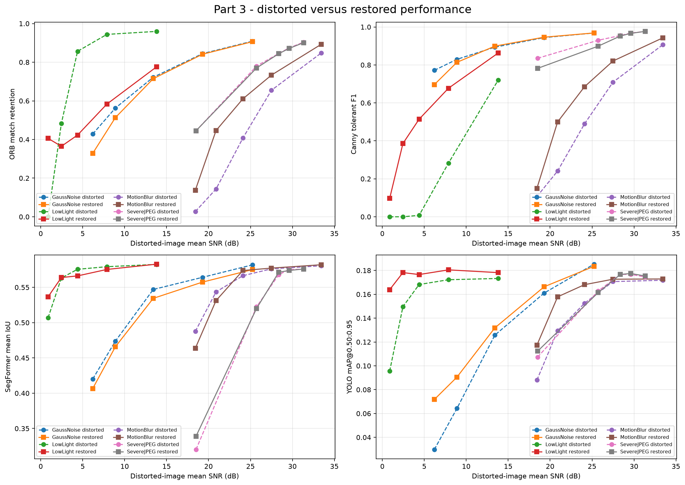
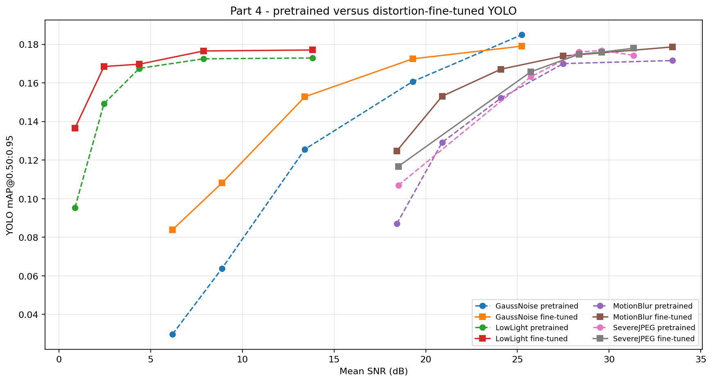

# Cityscapes Image Processing and Vision Robustness

This course project studies how classical and deep-learning vision methods behave when urban street images are degraded. It measures clean-image performance, applies controlled distortions, tests restoration methods, and prepares a distortion-aware YOLO fine-tuning experiment.

The implementation uses the Cityscapes dataset, deterministic experiments, ground-truth semantic and instance annotations, and reproducible CSV/JSON outputs. GPU acceleration is used for YOLO and SegFormer through PyTorch; the classical OpenCV pipeline remains on the CPU.

> **Current result status:** the repository includes a successful 125-image validation run for all four parts. Part 4 was trained for 20 epochs on 1,000 training images with 125 separate validation images. This is a substantial intermediate experiment, but the final benchmark should still use all 500 Cityscapes validation images and the complete 2,975-image training split.

## Project overview

The project has three experimental stages containing four numbered parts:

| Stage | Course part | Purpose |
|---|---:|---|
| Clean baselines | Part 1 | Evaluate ORB, Canny, SegFormer-B0, and YOLOv8n on clean Cityscapes validation images |
| Degradation and recovery | Parts 2-3 | Measure robustness under four distortions, apply restoration, and measure whether vision performance recovers |
| Robust adaptation | Part 4 | Fine-tune YOLO on a deterministic mixture of clean and distorted Cityscapes images and compare it with the pretrained detector |

Canny edge detection and motion blur are the additional methods included for the three-person project direction.

## Vision tasks and metrics

| Task | Method | Main metrics |
|---|---|---|
| Local feature detection and matching | ORB | keypoint retention, match retention, spatial inlier ratio |
| Edge detection | Canny | edge-pixel retention, tolerant precision, recall, F1 |
| Semantic segmentation | SegFormer-B0 trained on Cityscapes | per-class IoU, mean IoU, pixel accuracy, mean class accuracy |
| Object detection | YOLOv8n | AP@0.50, mAP@0.50:0.95, precision, recall, matched-box IoU |
| Image quality | SNR | per-image signal-to-noise ratio before and after restoration |

Cityscapes instance masks are converted to visible object bounding boxes. Detection evaluation uses the seven direct Cityscapes/COCO class matches: `person`, `bicycle`, `car`, `motorcycle`, `bus`, `train`, and `truck`. The Cityscapes `rider` class is excluded because COCO does not have a direct equivalent.

## Methods

### Distortions

| Distortion | Five default levels | Interpretation |
|---|---|---|
| Gaussian noise | sigma 5, 10, 20, 35, 50 | larger sigma means stronger additive noise |
| JPEG compression | quality 80, 60, 40, 20, 5 | lower quality means stronger compression artifacts |
| Low light | factor 0.80, 0.60, 0.40, 0.25, 0.10 | lower factor means a darker image |
| Motion blur | kernel 3, 5, 9, 15, 25 | larger kernel means stronger horizontal blur |

### Restoration

| Distortion | Part 3 restoration method |
|---|---|
| Gaussian noise | colored non-local means followed by bilateral filtering |
| JPEG compression | luminance-channel bilateral filtering |
| Low light | gamma lifting followed by CLAHE |
| Motion blur | severity-scaled unsharp filtering |

Restoration is evaluated rather than assumed to help. A negative SNR or task-metric gain is preserved in the output because aggressive restoration can remove useful features or create artifacts.

## Results: 125-image validation run

These results were generated with seed `7`, all five severity levels, CUDA inference, 125 Cityscapes validation images, and the strict detection metric mAP@0.50:0.95. Part 4 used 1,000 training images, 125 separate training-validation images, and 20 epochs. Raw results are available under [`outputs_big_125/`](outputs_big_125/).

The run completed successfully in 1 hour 57 minutes 28 seconds on an NVIDIA GeForce RTX 4060. Parts 2, 3, and 4 reuse the same image IDs and distortion seeds, and their shared metrics match exactly.

### Part 1: clean baselines

| Metric | Result |
|---|---:|
| SegFormer mean IoU | 0.5827 |
| SegFormer pixel accuracy | 0.9212 |
| YOLO mAP@0.50:0.95 | 0.1762 |
| YOLO mAP@0.50 | 0.2916 |
| YOLO recall@0.50 | 0.4792 |

The larger sample contains 2,214 ground-truth objects and all seven shared detection classes. Its detection baseline is lower than the earlier 20-image value because the new sample is more diverse and includes rare classes that were absent or represented by only a few objects in the smoke run.


### Part 2: distortion robustness

The table shows the strongest tested level of each distortion. ORB and Canny values are retention/F1 relative to the corresponding clean images.

| Condition | ORB match retention | Canny F1 | Segmentation mIoU | Detection mAP@0.50:0.95 |
|---|---:|---:|---:|---:|
| Clean | 1.0000 | 1.0000 | 0.5827 | 0.1762 |
| Gaussian noise, sigma 50 | 0.4284 | 0.7715 | 0.4201 | 0.0297 |
| JPEG, quality 5 | 0.4448 | 0.8351 | 0.3202 | 0.1069 |
| Low light, factor 0.10 | 0.0000 | 0.0000 | 0.5069 | 0.0953 |
| Motion blur, kernel 25 | 0.0269 | 0.1065 | 0.4876 | 0.0870 |

The results expose different failure modes: low light and motion blur strongly affect classical features, while severe noise and JPEG compression cause the largest segmentation and detection losses.


### Part 3: restoration

Restoration helps most when degradation is severe, but the fixed restoration strengths can over-process mild images.

| Condition | SNR before -> after | Segmentation mIoU before -> after | Detection mAP before -> after |
|---|---:|---:|---:|
| Gaussian noise, sigma 50 | 6.20 -> 17.54 dB | 0.4201 -> 0.4170 | 0.0297 -> 0.0837 |
| JPEG, quality 5 | 18.50 -> 19.14 dB | 0.3202 -> 0.3419 | 0.1069 -> 0.1116 |
| Low light, factor 0.10 | 0.87 -> 10.31 dB | 0.5069 -> 0.5376 | 0.0953 -> 0.1749 |
| Motion blur, kernel 25 | 18.42 -> 17.63 dB | 0.4876 -> 0.4815 | 0.0870 -> 0.0865 |

Across all 20 distortion/severity combinations, restoration improved SNR in 10, ORB in 6, Canny in 9, segmentation in 5, and detection in 11. Severe low-light restoration substantially improved image quality, segmentation, and detection. Severe Gaussian denoising improved SNR and detection but slightly reduced segmentation and classical-feature scores. The result supports a task-dependent conclusion: improving image quality does not guarantee improvement in every downstream vision metric.



### Part 4: distortion-aware fine-tuning

The 1,000-image, 20-epoch fine-tuning run preserved clean performance and improved robustness under most distortions:

| Comparison | Pretrained | Fine-tuned | Change |
|---|---:|---:|---:|
| Clean mAP@0.50:0.95 | 0.1762 | 0.1766 | +0.0004 |
| Mean distorted mAP@0.50:0.95 | 0.1415 | 0.1567 | +0.0152 |

The relative improvement in mean distorted mAP is approximately 10.8%, and 17 of 20 distorted conditions improved. The largest gains occurred for Gaussian noise sigma 50 (+0.0542), Gaussian noise sigma 35 (+0.0443), low light factor 0.10 (+0.0412), and motion blur kernel 25 (+0.0378). Small regressions remained for Gaussian noise sigma 5 and JPEG qualities 60 and 40, showing the expected trade-off between severe-distortion robustness and mild-condition performance.



## Dataset

Download `leftImg8bit_trainvaltest.zip` and `gtFine_trainvaltest.zip` from the [Cityscapes website](https://www.cityscapes-dataset.com/) and extract them under one dataset root:

```text
data/cityscapes/
|-- leftImg8bit/
|   |-- train/<city>/*_leftImg8bit.png
|   `-- val/<city>/*_leftImg8bit.png
`-- gtFine/
    |-- train/<city>/*_gtFine_labelIds.png
    |                    *_gtFine_instanceIds.png
    `-- val/<city>/*_gtFine_labelIds.png
                         *_gtFine_instanceIds.png
```

Raw Cityscapes `labelIds` are converted in memory to the 19 training IDs. Existing `labelTrainIds` files also work. Reported evaluation scores should use `val`; Cityscapes test annotations are withheld.

## Installation

Python 3.10 or newer is recommended. From PowerShell in the repository root:

```powershell
python -m venv .venv
.\.venv\Scripts\Activate.ps1
python -m pip install --upgrade pip
python -m pip install -r requirements.txt
```

### NVIDIA CUDA setup

```powershell
powershell -ExecutionPolicy Bypass -File .\setup_cuda.ps1
python -c "import torch; print(torch.__version__); print(torch.cuda.is_available()); print(torch.cuda.get_device_name(0))"
```

The first model run downloads `yolov8n.pt` and `nvidia/segformer-b0-finetuned-cityscapes-1024-1024`.

Use `--device cuda` for GPU inference and training, `--device cuda:0` to select a GPU, or `--device cpu` for CPU execution. CUDA half precision is enabled by default; use `--no-half` if the GPU does not support it reliably.

CuPy is intentionally not required. Gaussian noise generation is inexpensive compared with model inference, and transferring full-resolution images between NumPy and CuPy would add overhead. YOLO and SegFormer already remain on the GPU through PyTorch.

## Running the project

All commands are run from the repository root. The entry point accepts `--part 1`, `2`, `3`, `4`, or `all`.

### Quick end-to-end smoke test

This uses four evaluation images, two distortion levels, one Part 4 epoch, and small training limits:

```powershell
python .\main.py `
  --dataset-root .\data\cityscapes `
  --output-dir .\outputs_quick `
  --artifacts-dir .\artifacts `
  --part all `
  --quick `
  --device cuda
```

### Run each part separately

```powershell
python .\main.py --dataset-root .\data\cityscapes --output-dir .\outputs --part 1 --device cuda
python .\main.py --dataset-root .\data\cityscapes --output-dir .\outputs --part 2 --device cuda
python .\main.py --dataset-root .\data\cityscapes --output-dir .\outputs --part 3 --device cuda
python .\main.py --dataset-root .\data\cityscapes --output-dir .\outputs --artifacts-dir .\artifacts --part 4 --device cuda
```

Part 2 automatically computes the clean Part 1 references it needs.

### Run the complete experiment

Omitting `--max-samples` uses all 500 validation images. Part 4 defaults to all 2,975 Cityscapes training images, all 500 validation images, and 20 epochs.

```powershell
python .\main.py `
  --dataset-root .\data\cityscapes `
  --output-dir .\outputs_full `
  --artifacts-dir .\artifacts `
  --part all `
  --device cuda
```

The full pipeline is long. Running the parts separately is safer because completed result files and prepared Part 4 data can be reused.

### Evaluate an existing fine-tuned checkpoint

```powershell
python .\main.py `
  --dataset-root .\data\cityscapes `
  --output-dir .\outputs_part4 `
  --part 4 `
  --device cuda `
  --fine-tuned-weights .\artifacts\part4\training_runs\<run-name>\weights\best.pt
```

## Main configuration options

| Option | Default | Meaning |
|---|---:|---|
| `--part` | `all` | Run one numbered part or the complete pipeline |
| `--split` | `val` | Cityscapes evaluation split |
| `--max-samples` | `0` | Deterministic evaluation limit; `0` means all 500 validation images |
| `--seed` | `7` | Sampling, distortion, assignment, and training seed |
| `--device` | `auto` | `auto`, `cpu`, `cuda`, `cuda:0`, or `mps` |
| `--no-half` | off | Disable CUDA half precision |
| `--quick` | off | Use tiny limits for a smoke test |
| `--nfeatures` | `800` | Maximum ORB features per image |
| `--orb-ratio-threshold` | `0.75` | ORB descriptor ratio-test threshold |
| `--orb-spatial-threshold` | `3.0` | Maximum aligned-keypoint distance in pixels |
| `--canny-low-threshold` | `100` | Lower Canny hysteresis threshold |
| `--canny-high-threshold` | `200` | Upper Canny hysteresis threshold |
| `--canny-blur-kernel` | `5` | Positive odd Gaussian pre-blur size |
| `--canny-tolerance-radius` | `2` | Edge-matching tolerance in pixels |
| `--yolo-eval-confidence` | `0.001` | Low confidence floor used to build the precision-recall curve |
| `--yolo-visual-confidence` | `0.25` | Confidence floor used only in gallery figures |
| `--gallery-samples` | `4` | Number of representative gallery samples |
| `--part4-train-samples` | `0` | Part 4 training limit; `0` means all 2,975 training images |
| `--part4-val-samples` | `0` | Part 4 validation limit; `0` means all 500 validation images |
| `--part4-epochs` | `20` | YOLO fine-tuning epochs |
| `--part4-image-size` | `640` | YOLO training resolution |
| `--part4-batch` | `8` | Training batch size; reduce it after a CUDA out-of-memory error |
| `--part4-clean-fraction` | `0.20` | Fraction of clean images in the robust training mixture |
| `--rebuild-training-data` | off | Recreate the cached Part 4 training dataset |

Run `python .\main.py --help` for every available option.

## Output files

Each run records aggregate results, per-image data, per-class metrics, plots, and the full configuration:

```text
outputs/
|-- run_manifest.json
|-- run_manifest_parts_3_4.json
|-- part1/
|   |-- clean_summary.json
|   |-- clean_per_image.csv
|   |-- segmentation_per_class.csv
|   |-- detection_per_class.csv
|   `-- figures/
|-- part2/
|   |-- distorted_summary.json
|   |-- distorted_summary.csv
|   |-- distorted_per_image.csv
|   `-- figures/
|-- part3/
|   |-- restoration_summary.json
|   |-- restoration_summary.csv
|   |-- restoration_per_image.csv
|   `-- figures/
`-- part4/
    |-- fine_tuning_summary.json
    |-- fine_tuning_summary.csv
    |-- detection_per_class.csv
    |-- run_summary.json
    `-- figures/
```

Useful tracked examples from the 125-image run:

- [Part 1 clean summary](outputs_big_125/part1/clean_summary.json)
- [Part 2 aggregate results](outputs_big_125/part2/distorted_summary.csv)
- [Part 2 per-image results](outputs_big_125/part2/distorted_per_image.csv)
- [Part 3 aggregate results](outputs_big_125/part3/restoration_summary.csv)
- [Part 3 per-image results](outputs_big_125/part3/restoration_per_image.csv)
- [Part 4 fine-tuning results](outputs_big_125/part4/fine_tuning_summary.csv)
- [Complete run configuration](outputs_big_125/run_manifest_parts_3_4.json)

## Reproducibility and evaluation design

- Sample selection and every synthetic distortion are deterministic under `--seed`.
- SNR is calculated for every evaluated image and then aggregated; plots do not use an unrelated example image for their x-axis.
- Part 2 and Part 3 reuse the same image IDs and distortion seeds for paired comparisons.
- Semantic void label `255` is ignored.
- Detection uses a low confidence floor and 101-point AP interpolation at IoU thresholds 0.50 through 0.95.
- Part 4 uses Cityscapes ground-truth instance masks, not model-generated pseudo-labels.
- Part 4 training and validation images come from separate Cityscapes splits.
- Manifests store the configuration and prepared-dataset identity for later auditing.

SNR is computed as:

```text
10 * log10(mean(clean^2) / mean((clean - test)^2))
```

## Repository organization

```text
images_project/
|-- main.py                         # Small unified entry point
|-- cityscapes_project/
|   |-- cli.py                      # Command-line interface
|   |-- config.py                   # Constants and experiment dataclasses
|   |-- dataset.py                  # Discovery, loading, label and box conversion
|   |-- types.py                    # Shared data records
|   |-- methods/
|   |   |-- classical.py            # ORB and Canny
|   |   |-- distortions.py          # Distortions, SNR, deterministic seeds
|   |   |-- restoration.py          # Part 3 restoration methods
|   |   |-- segmentation.py         # SegFormer inference and metrics
|   |   `-- detection.py            # YOLO conversion and AP metrics
|   |-- pipelines/
|   |   |-- parts12.py              # Parts 1 and 2 orchestration
|   |   `-- parts34.py              # Parts 3 and 4 orchestration
|   `-- utils/
|       |-- dependencies.py         # Optional dependency messages
|       |-- device.py               # CUDA/CPU selection and model loading
|       |-- io.py                   # JSON and CSV output
|       |-- timing.py               # Runtime measurement and extrapolation
|       `-- visualization.py        # Galleries and plots
|-- tests/
|   |-- test_core_methods.py
|   |-- test_restoration_and_training.py
|   `-- test_timing.py
|-- requirements.txt
`-- setup_cuda.ps1
```

## Tests

The tests do not download model weights:

```powershell
python -m unittest discover -s tests -v
```

They cover Cityscapes discovery and label mapping, deterministic distortions, restoration functions, ORB and Canny support, SNR, segmentation metrics, detection AP, YOLO label conversion, training-data assignment, runtime extrapolation, and lightweight output creation.

## Runtime estimate

The measured 125-image Parts 1-4 run took **1 hour 57 minutes 28 seconds** on an NVIDIA GeForce RTX 4060:

| Stage | Measured time |
|---|---:|
| Parts 1-2 | approximately 19 minutes |
| Part 3 | approximately 75 minutes |
| Part 4 | approximately 24 minutes |

Scaling the evaluation-heavy stages from 125 to all 500 validation images suggests approximately 7.5 to 9 hours for the complete default pipeline on the same machine. Part 3 remains the largest bottleneck because OpenCV non-local-means restoration runs on the CPU. Part 4 training itself was comparatively fast: the 1,000-image, 20-epoch training phase completed in about 3 minutes 23 seconds, while dataset preparation and multi-condition evaluation accounted for most of Part 4's time.

Actual runtime depends on GPU model, CUDA installation, disk speed, cached model weights, CPU load, and thermal limits. Running the parts separately is recommended for the final 500-image experiment.

## Assumptions and known limitations

- The tracked 125-image results are substantially more reliable than the smoke runs but still cover only one quarter of the 500-image validation split.
- The full 500-image validation run has not yet been committed.
- Part 4 used 1,000 of the 2,975 available training images; the complete training split may change the robustness trade-off.
- Fixed restoration parameters can over-process mildly distorted images; Part 3 therefore reports both positive and negative gains.
- The Cityscapes and COCO label spaces are not identical, so only seven direct classes are evaluated.
- Ground-truth detection boxes represent visible instance-mask pixels, not amodal object extents.
- Some shared detection classes may be absent from a small sample; only classes with ground-truth instances contribute to mAP.
- Part 3 remains CPU-heavy, while model inference and training can use CUDA.
