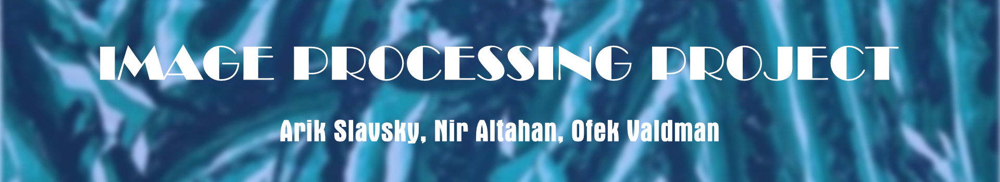

In the project we study how classical and deep learning vision methods behave when urban street images are degraded. It measures clean-image performance, applies distortions, tests restoration methods, and trains a distortion-aware YOLO detector.

The implementation uses the Cityscapes dataset, deterministic experiments, ground-truth semantic and instance annotations, and reproducible CSV/JSON outputs. GPU acceleration is used for YOLO and SegFormer through PyTorch; the classical OpenCV pipeline remains on the CPU.

## Project overview

The project has three experimental stages containing four numbered parts:

| Stage | Course part | Purpose |
|---|---:|---|
| Clean baselines | Part 1 | Evaluate ORB, Canny, SegFormer-B0, and YOLOv8n on clean Cityscapes validation images |
| Degradation and recovery | Parts 2-3 | Measure robustness under four distortions, apply restoration, and measure whether vision performance recovers |
| Robust adaptation | Part 4 | Fine-tune YOLO on a deterministic mixture of clean and distorted Cityscapes images and compare it with the pretrained detector |

Canny edge detection and motion blur are the additional methods included for the three-person project direction.

## Vision tasks and metrics

| Task | Method | Main metrics |
|---|---|---|
| Local feature detection and matching | ORB | keypoint retention, match retention, spatial inlier ratio |
| Edge detection | Canny | edge-pixel retention, tolerant precision, recall, F1 |
| Semantic segmentation | SegFormer-B0 trained on Cityscapes | per-class IoU, mean IoU, pixel accuracy, mean class accuracy |
| Object detection | YOLOv8n | AP@0.50, mAP@0.50:0.95, precision, recall, matched-box IoU |
| Image quality | SNR, PSNR, SSIM, MAE | paired per-image fidelity before and after restoration |

Cityscapes instance masks are converted to visible object bounding boxes. Detection evaluation uses the seven direct Cityscapes/COCO class matches: `person`, `bicycle`, `car`, `motorcycle`, `bus`, `train`, and `truck`. The Cityscapes `rider` class is excluded because COCO does not have a direct equivalent.

## Methods

### Distortions

| Distortion | Five default levels | Interpretation |
|---|---|---|
| Gaussian noise | sigma 5, 10, 20, 35, 50 | larger sigma means stronger additive noise |
| JPEG compression | quality 80, 60, 40, 20, 5 | lower quality means stronger compression artifacts |
| Low light | factor 0.80, 0.60, 0.40, 0.25, 0.10 | lower factor means a darker image |
| Motion blur | kernel 3, 5, 9, 15, 25 | larger kernel means stronger horizontal blur |

### Restoration

| Distortion | Part 3 restoration method |
|---|---|
| Gaussian noise | severity-aware colored non-local means with conservative mild-level blending and severe-level bilateral residual cleanup |
| JPEG compression | 8x8 boundary-aware luminance deblocking that preserves texture away from JPEG block boundaries |
| Low light | severity-scaled gamma lifting and CLAHE, blended conservatively at mild levels |
| Motion blur | known-PSF Tikhonov deconvolution with a Laplacian smoothness prior and reflected-border handling |

Restoration recipe version 4 is based on classical methods covered by the course and their primary literature: [non-local means](https://doi.org/10.1109/CVPR.2005.38), [signal-adaptive JPEG deblocking](https://doi.org/10.1109/83.661000), [CLAHE](https://doi.org/10.1016/0734-189X(87)90186-X), and [Tikhonov regularization](https://doi.org/10.2307/2006224). Its severity schedules remain unchanged from v3. A bounded train-only study selected one fixed output-strength scalar per distortion family from `{0.70, 0.85, 1.00}`; v4 freezes `0.70` for Gaussian noise and JPEG and `1.00` for low light and motion blur. The scalar never varies by image, severity, or task.

Part 3 is a paired experiment: the distorted and restored measurements use the same Cityscapes image, annotation, and distortion seed. In addition to aggregate ORB, Canny, SegFormer, and YOLO results, it records per-image PSNR, luminance SSIM, MAE, runtime, and restoration parameters. A deterministic paired bootstrap reports the mean improvement, median improvement, 95% confidence interval, win rate, and tie rate for every image-level metric. Negative gains remain visible rather than being filtered out.

The detection evaluator is versioned. Version 2 matches each prediction to the highest-IoU *available* ground-truth box, fixing the crowded-object case in which the global best box was already claimed. When Part 2 results are reused, Part 3 reuses only validated ORB, Canny, and SegFormer baselines and recomputes distorted YOLO predictions so both detection conditions use evaluator version 2.

## Results

Parts 1-2 use the peer's seed-`7` 125-image run under [`outputs_big_125/`](outputs_big_125/). Part 3 uses the same 125 evaluation IDs in a separate official-data run with evaluator v2 and expanded statistical outputs. Part 4 uses the final three-seed recipe-v3 run on all 500 official validation images.

### Part 1: clean baselines

| Metric | Result |
|---|---:|
| SegFormer mean IoU | 0.5827 |
| SegFormer pixel accuracy | 0.9212 |
| YOLO mAP@0.50:0.95 | 0.1762 |
| YOLO mAP@0.50 | 0.2916 |
| YOLO recall@0.50 | 0.4792 |

The 125-image cohort contains 2,214 ground-truth objects and all seven shared detection classes.

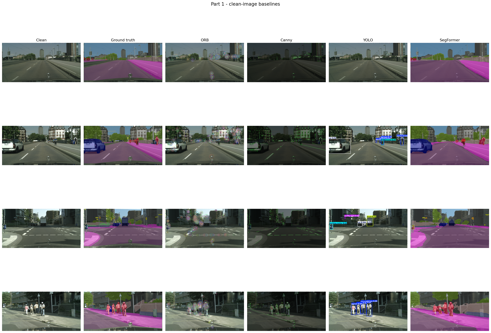

### Part 2: distortion robustness

The table shows the strongest tested level of each distortion. ORB and Canny values are retention/F1 relative to the corresponding clean images.

| Condition | ORB match retention | Canny F1 | Segmentation mIoU | Detection mAP@0.50:0.95 |
|---|---:|---:|---:|---:|
| Clean | 1.0000 | 1.0000 | 0.5827 | 0.1762 |
| Gaussian noise, sigma 50 | 0.4284 | 0.7715 | 0.4201 | 0.0297 |
| JPEG, quality 5 | 0.4448 | 0.8351 | 0.3202 | 0.1069 |
| Low light, factor 0.10 | 0.0000 | 0.0000 | 0.5069 | 0.0953 |
| Motion blur, kernel 25 | 0.0269 | 0.1065 | 0.4876 | 0.0870 |

The results expose different failure modes: low light and motion blur strongly affect classical features, while severe noise and JPEG compression cause the largest segmentation and detection losses.

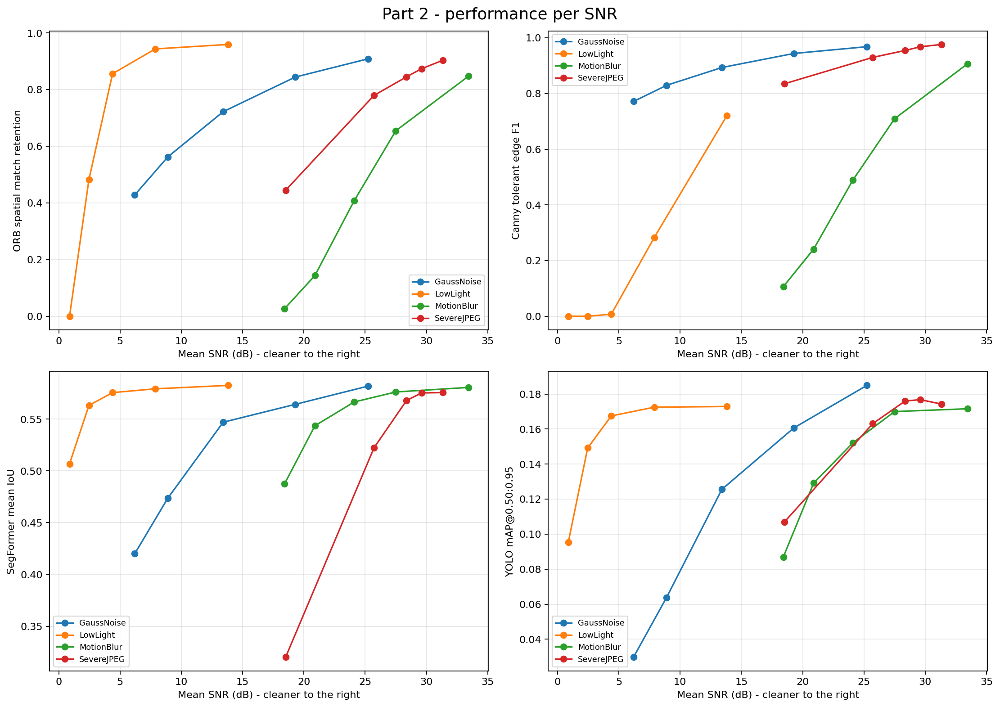

### Part 3: restoration

Recipe v4 was selected without inspecting official `val`. Development used 125 city-balanced official-`train` images from Darmstadt, Krefeld, Monchengladbach, and Ulm. The 12 family-level candidates balanced fidelity (PSNR, SSIM, MAE) and classical structure (ORB, Canny). The frozen candidates were then checked on 12 images from disjoint train cities, Aachen and Bochum; mean segmentation and detection change versus v3 had to remain above `-0.005`. Both proposed `0.70` strengths passed. There is no per-image routing, identity gate, or validation-set tuning.

The final run used seed `7`, the same 125 official validation images as v3, all 20 variants, recipe v4, and detection evaluator v2. Matching Part 2 ORB, Canny, and SegFormer baselines were structurally validated and reused; quality metrics and both distorted/restored YOLO predictions were recomputed. Batched YOLO inference reduced overhead without changing its checkpoint, image size, confidence floor, or evaluator.

| Strongest condition | PSNR gain | SSIM gain | Segmentation mIoU gain | Detection mAP gain |
|---|---:|---:|---:|---:|
| Gaussian noise, sigma 50 | +4.857 dB | +0.171 | +0.0114 | +0.0414 |
| JPEG, quality 5 | +0.530 dB | +0.032 | +0.0150 | +0.0044 |
| Low light, factor 0.10 | +6.476 dB | +0.707 | +0.0297 | +0.0684 |
| Motion blur, kernel 25 | +1.766 dB | +0.028 | -0.0240 | +0.0286 |

SSIM improved in all 20 variants; PSNR and MAE improved in 19; detection mAP improved in 19; Canny in 14; segmentation in 11; and ORB in 7. On the identical v3/v4 cohort, the conservative noise/JPEG blend reduced average fidelity-gain magnitude but improved mean ORB retention by `+0.01569`/`+0.00252` and Canny F1 by `+0.01246`/`+0.00949`. Noise segmentation improved by `+0.01008`; JPEG changed by `-0.00081`. Cross-recipe detection deltas are not presented as causal because v4 uses batched inference, although each v4 distorted/restored comparison remains internally matched. Paired bootstrap intervals and win rates retain every positive and negative image-level result.

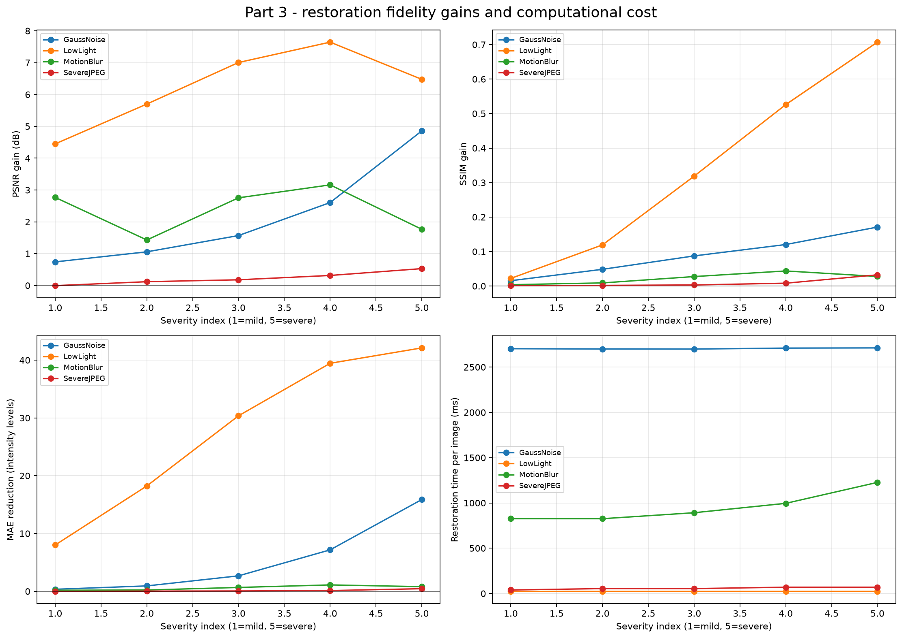

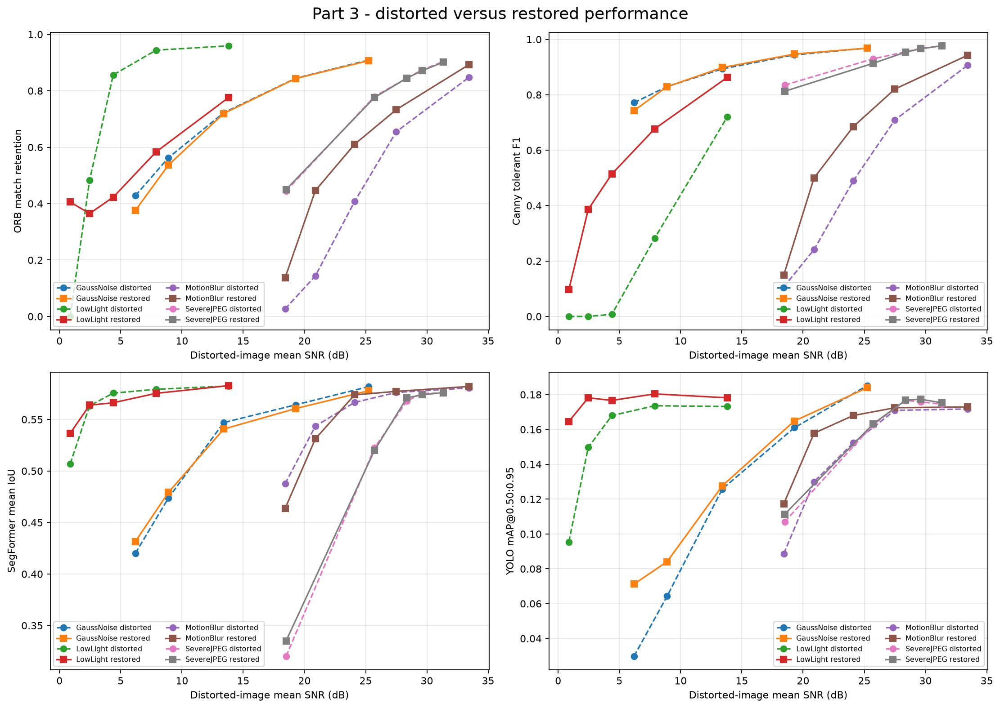

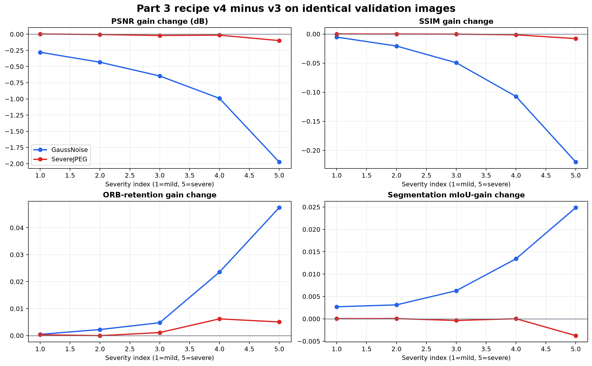

### Part 4: distortion-aware fine-tuning

The final protocol eliminates the earlier run's validation leakage and unintended JPEG contamination. Four Cityscapes training cities (Darmstadt, Krefeld, Monchengladbach, and Ulm; 373 sources) form the internal validation set; the other 14 cities provide 2,602 training sources. Every training source contributes its exact clean PNG plus three deterministic corrupted views, evenly covering all 20 distortion/severity pairs (10,408 training images total). Internal validation uses a clean and corrupted view per source (746 images). Official `val` remains untouched until final evaluation.

YOLOv8n was fine-tuned from the same COCO checkpoint with AdamW, cosine learning-rate decay, mixed precision, a 40-epoch ceiling, and patience 10. Seeds 7, 17, and 29 selected epochs 24, 30, and 34 with city-disjoint internal mAP values 0.260, 0.268, and 0.249. No seed was selected or discarded using final data.

All models were evaluated with detector evaluator v2 on the same 500 official validation images and deterministic distortions. Values below are the mean across the three robust seeds; `±` is the sample standard deviation across seeds.

| Comparison | COCO pretrained | Robust mean ± seed SD | Absolute change |
|---|---:|---:|---:|
| Clean mAP@0.50:0.95 | 0.1600 | 0.2581 ± 0.0091 | +0.0981 |
| Mean over 20 corruptions | 0.1312 | 0.2346 ± 0.0060 | +0.1035 |

Mean corrupted mAP improved by 78.9% relative. All 60 seed-condition comparisons improved, not only the three-seed average: the weakest individual-seed gain was +0.0800. A deterministic 20,000-resample condition-paired bootstrap gives `[+0.0987, +0.1089]`; a conservative Student-t interval across the three independently trained seed means gives `[+0.0886, +0.1183]`. The corresponding seed-level clean-gain interval is `[+0.0754, +0.1208]`. These small-sample seed intervals are stability diagnostics, not population-level claims.

| Distortion family | Mild → severe setting | Mean SNR, mild → severe | Pretrained mean | Robust mean | Mean gain | Smallest condition gain |
|---|---:|---:|---:|---:|---:|---:|
| Gaussian noise | σ 5 → 50 | 25.18 → 6.15 dB | 0.1013 | 0.2123 | +0.1110 | +0.0881 |
| Severe JPEG | quality 80 → 5 | 31.23 → 18.48 dB | 0.1455 | 0.2414 | +0.0959 | +0.0943 |
| Low light | gain 0.80 → 0.10 | 13.82 → 0.87 dB | 0.1450 | 0.2486 | +0.1036 | +0.0957 |
| Motion blur | kernel 3 → 25 | 33.23 → 18.25 dB | 0.1330 | 0.2363 | +0.1033 | +0.1001 |

The effect is not an artifact of retaining very low-confidence predictions. At the fixed 0.25 operating threshold, mean corrupted precision rises from 0.5413 to 0.6006, recall from 0.1991 to 0.3604, and F1 from 0.2603 to 0.4418. mAP@0.50 rises from 0.2166 to 0.3909.

| Class (official-val instances) | Pretrained corrupted mean | Robust mean ± seed SD | Change | Worst condition change |
|---|---:|---:|---:|---:|
| Person (3,395) | 0.1335 | 0.2085 ± 0.0053 | +0.0750 | +0.0490 |
| Bicycle (1,165) | 0.0804 | 0.1487 ± 0.0013 | +0.0684 | +0.0539 |
| Car (4,653) | 0.3014 | 0.4323 ± 0.0029 | +0.1309 | +0.1036 |
| Motorcycle (149) | 0.0372 | 0.1097 ± 0.0030 | +0.0725 | +0.0372 |
| Bus (98) | 0.2275 | 0.3816 ± 0.0193 | +0.1541 | +0.1067 |
| Train (23) | 0.0294 | 0.1441 ± 0.0150 | +0.1147 | +0.0785 |
| Truck (93) | 0.1089 | 0.2176 ± 0.0076 | +0.1087 | +0.0933 |

All 140 class-condition averages improved. Bus and train no longer collapse as in the preliminary peer checkpoint, although their larger seed SDs are interpreted cautiously because official validation contains only 98 bus and 23 train instances. All four acceptance gates declared before the final run passed: clean change at least -0.005, positive condition-bootstrap lower bound, at least 16/20 nonnegative conditions, and no supported-class regression larger than 0.01. The observed results exceed these gates by wide margins.

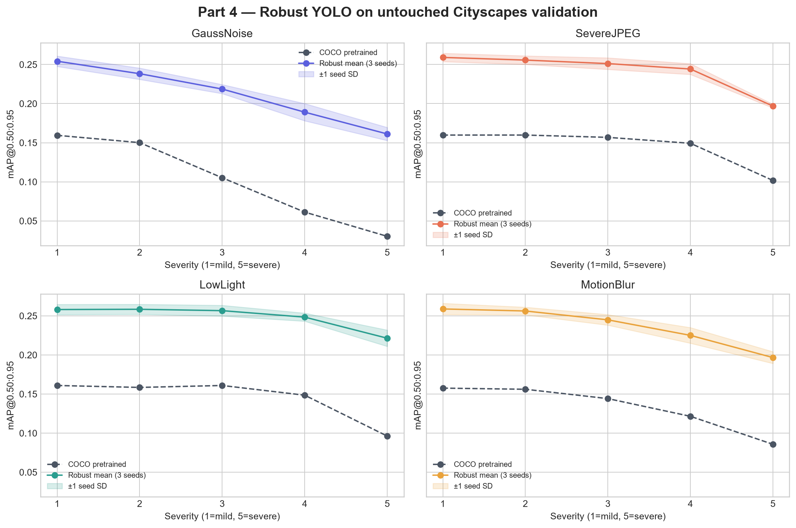

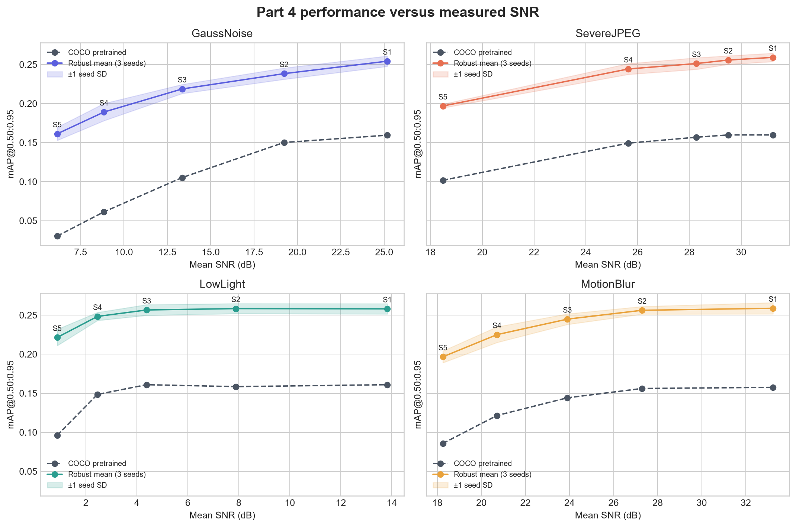

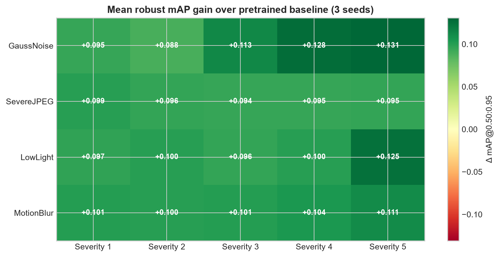

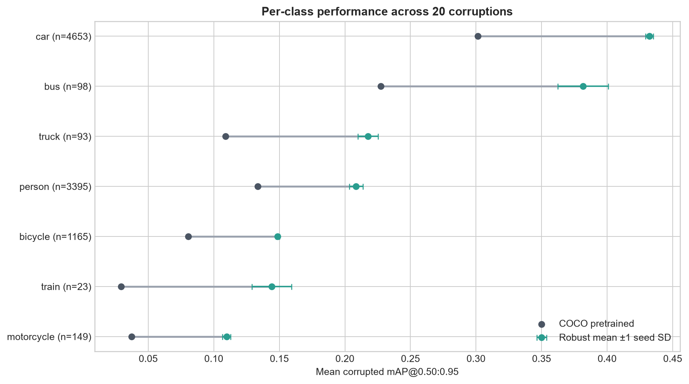

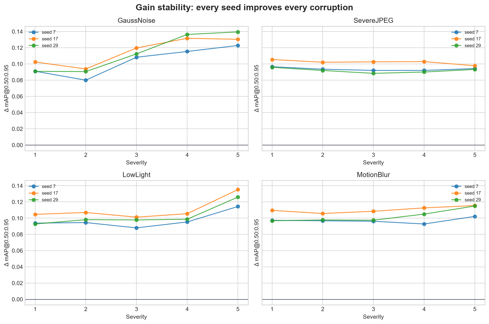

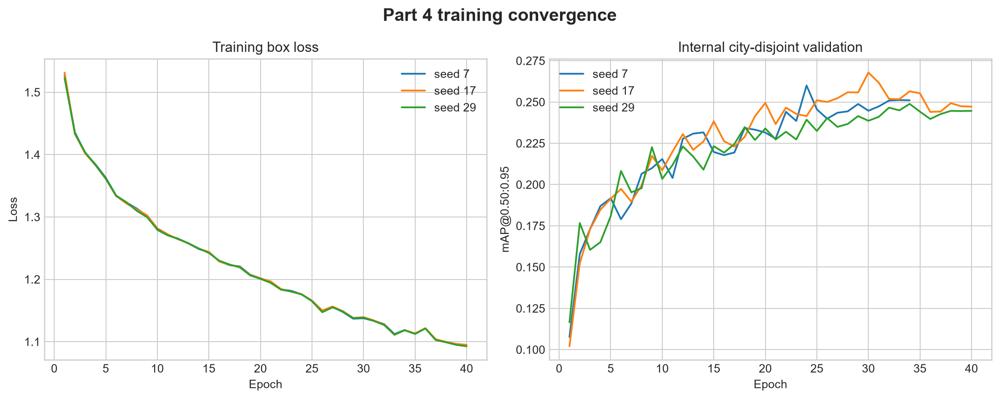

## Dataset

The project uses the official full-resolution Cityscapes images and fine annotations,
including the instance-ID masks used to derive object-detection ground truth. Download
`leftImg8bit_trainvaltest.zip` and `gtFine_trainvaltest.zip` after accepting the terms
on the [Cityscapes website](https://www.cityscapes-dataset.com/).

Whichever route is used, place the extracted files under one dataset root:

```text
data/cityscapes/
|-- leftImg8bit/
|   |-- train/<city>/*_leftImg8bit.png
|   `-- val/<city>/*_leftImg8bit.png
`-- gtFine/
    |-- train/<city>/*_gtFine_labelIds.png
    |                    *_gtFine_instanceIds.png
    `-- val/<city>/*_gtFine_labelIds.png
                         *_gtFine_instanceIds.png
```

Raw Cityscapes `labelIds` are converted in memory to the 19 training IDs. Existing `labelTrainIds` files also work. Reported evaluation scores should use `val`; Cityscapes test annotations are withheld.

## Installation

Python 3.10 or newer is recommended. From PowerShell in the repository root:

```powershell
python -m venv .venv
.\.venv\Scripts\Activate.ps1
python -m pip install --upgrade pip
python -m pip install -r requirements.txt
```

### NVIDIA CUDA setup

```powershell
powershell -ExecutionPolicy Bypass -File .\setup_cuda.ps1
python -c "import torch; print(torch.__version__); print(torch.cuda.is_available()); print(torch.cuda.get_device_name(0))"
```

The first model run downloads the pretrained weights `yolov8n.pt` and
`nvidia/segformer-b0-finetuned-cityscapes-1024-1024`. These are model weights only;
they do not contain the Cityscapes dataset described above.

Use `--device cuda` for GPU inference and training, `--device cuda:0` to select a GPU, or `--device cpu` for CPU execution. CUDA half precision is enabled by default; use `--no-half` if the GPU does not support it reliably.

## Running the project

All commands are run from the repository root. The entry point accepts `--part 1`, `2`, `3`, `4`, or `all`.

### Quick end-to-end smoke test

This uses four evaluation images, two distortion levels, one Part 4 epoch, and small training limits:

```powershell
python .\main.py `
  --dataset-root .\data\cityscapes `
  --output-dir .\outputs_quick `
  --artifacts-dir .\artifacts `
  --part all `
  --quick `
  --device cuda
```

### Run each part separately

```powershell
python .\main.py --dataset-root .\data\cityscapes --output-dir .\outputs --part 1 --device cuda
python .\main.py --dataset-root .\data\cityscapes --output-dir .\outputs --part 2 --device cuda
python .\main.py --dataset-root .\data\cityscapes --output-dir .\outputs --part 3 --device cuda
python .\main.py --dataset-root .\data\cityscapes --output-dir .\outputs --artifacts-dir .\artifacts --part 4 --device cuda
```

Part 2 automatically computes the clean Part 1 references it needs.

### Run the complete experiment

Omitting `--max-samples` uses all 500 validation images. Part 4 defaults to a city-disjoint 12.5% internal holdout from official `train`, four prepared training views per remaining source, and a 40-epoch ceiling with patience 10.

```powershell
python .\main.py `
  --dataset-root .\data\cityscapes `
  --output-dir .\outputs_final `
  --artifacts-dir .\artifacts `
  --part all `
  --device cuda
```

The full pipeline is long. Running the parts separately is safer. Each completed severity variant is checkpointed, Part 3 reuses structurally complete, exactly matching Part 2 ORB/Canny/SegFormer baselines by default, and prepared Part 4 data is cached. Part 3 always recomputes distorted detection for evaluator consistency. Use `--no-reuse-part2` only for an independent recomputation of every distorted baseline.

### Evaluate an existing fine-tuned checkpoint

```powershell
python .\main.py `
  --dataset-root .\data\cityscapes `
  --output-dir .\outputs_part4 `
  --part 4 `
  --device cuda `
  --fine-tuned-weights .\artifacts\part4\training_runs\<run-name>\weights\best.pt
```

### Reproduce the final Part 4 protocol

```powershell
python .\scripts\run_part4_final.py `
  --dataset-root .\data\cityscapes `
  --output-dir .\outputs_part4_v3_official `
  --artifacts-dir .\artifacts_final `
  --epochs 40 --batch 32 --workers 8 --eval-batch 32
```

This entry point trains seeds 7, 17, and 29 on one common prepared dataset, evaluates
every checkpoint and the COCO baseline on all 500 untouched validation images, and
writes recoverable progress after each of the 21 clean/corrupted conditions.

## Main configuration options

| Option | Default | Meaning |
|---|---:|---|
| `--part` | `all` | Run one numbered part or the complete pipeline |
| `--split` | `val` | Cityscapes evaluation split |
| `--max-samples` | `0` | Deterministic evaluation limit; `0` means all 500 validation images |
| `--seed` | `7` | Sampling, distortion, assignment, and training seed |
| `--device` | `auto` | `auto`, `cpu`, `cuda`, `cuda:0`, or `mps` |
| `--no-half` | off | Disable CUDA half precision |
| `--quick` | off | Use tiny limits for a smoke test |
| `--nfeatures` | `800` | Maximum ORB features per image |
| `--orb-ratio-threshold` | `0.75` | ORB descriptor ratio-test threshold |
| `--orb-spatial-threshold` | `3.0` | Maximum aligned-keypoint distance in pixels |
| `--canny-low-threshold` | `100` | Lower Canny hysteresis threshold |
| `--canny-high-threshold` | `200` | Upper Canny hysteresis threshold |
| `--canny-blur-kernel` | `5` | Positive odd Gaussian pre-blur size |
| `--canny-tolerance-radius` | `2` | Edge-matching tolerance in pixels |
| `--yolo-eval-confidence` | `0.001` | Low confidence floor used to build the precision-recall curve |
| `--yolo-visual-confidence` | `0.25` | Confidence floor used only in gallery figures |
| `--gallery-samples` | `4` | Number of representative gallery samples |
| `--part3-bootstrap-resamples` | `1000` | Deterministic paired bootstrap samples per Part 3 metric and severity |
| `--part3-confidence-level` | `0.95` | Confidence level for paired Part 3 intervals |
| `--part4-train-samples` | `0` | Part 4 training limit; `0` means all 2,975 training images |
| `--part4-val-samples` | `0` | Internal city-disjoint validation limit; `0` means the complete held-out subset of `train` |
| `--part4-epochs` | `40` | Maximum YOLO fine-tuning epochs; patience-based early stopping is enabled |
| `--part4-image-size` | `640` | YOLO training resolution |
| `--part4-batch` | `8` | Training batch size; reduce it after a CUDA out-of-memory error |
| `--part4-train-views` | `4` | Views per training source: one exact clean anchor plus balanced corruptions |
| `--part4-val-views` | `2` | Views per internal-validation source |
| `--part4-internal-val-fraction` | `0.125` | Target fraction of official `train` held out by whole city |
| `--part4-patience` | `10` | Early-stopping patience in epochs |
| `--part4-eval-batch` | `32` | Batched final-inference size |
| `--rebuild-training-data` | off | Recreate the cached Part 4 training dataset |
| `--no-reuse-part2` | off | Recompute distorted Part 3 baselines instead of reusing a complete matching Part 2 run |

Run `python .\main.py --help` for every available option.

## Output files

Each run records aggregate results, per-image data, per-class metrics, plots, and the full configuration:

```text
outputs/
|-- run_manifest.json
|-- run_manifest_parts_3_4.json
|-- part1/
|   |-- clean_summary.json
|   |-- clean_per_image.csv
|   |-- segmentation_per_class.csv
|   |-- detection_per_class.csv
|   `-- figures/
|-- part2/
|   |-- distorted_summary.json
|   |-- distorted_summary.csv
|   |-- distorted_per_image.csv
|   `-- figures/
|-- part3/
|   |-- restoration_summary.json
|   |-- restoration_summary.csv
|   |-- restoration_per_image.csv
|   |-- paired_statistics.csv
|   |-- restoration_manifest.json
|   `-- figures/
`-- part4/
    |-- fine_tuning_summary.csv
    |-- model_condition_metrics.csv
    |-- detection_per_class.csv
    |-- seed_summary.csv
    |-- distortion_family_summary.csv
    |-- per_class_robustness_summary.csv
    |-- final_analysis.json
    |-- experiment_manifest.json
    |-- run_summary.json
    |-- checkpoints/
    |-- training/
    |-- training_dataset/
    `-- figures/
```

Useful tracked results:

- [Part 1 clean summary](outputs_big_125/part1/clean_summary.json)
- [Part 2 aggregate results](outputs_big_125/part2/distorted_summary.csv)
- [Part 2 per-image results](outputs_big_125/part2/distorted_per_image.csv)
- [Part 3 recipe-v4 aggregate results](outputs_part3_v4_125_official/part3/restoration_summary.csv)
- [Part 3 recipe-v4 per-image results](outputs_part3_v4_125_official/part3/restoration_per_image.csv)
- [Part 3 paired bootstrap statistics](outputs_part3_v4_125_official/part3/paired_statistics.csv)
- [Part 3 reproducibility manifest](outputs_part3_v4_125_official/part3/restoration_manifest.json)
- [Part 3 train-only tuning manifest](outputs_part3_v4_tuning_125/tuning_manifest.json)
- [Part 3 disjoint-city confirmation](outputs_part3_v4_confirmation/confirmation_manifest.json)
- [Part 3 paired v4-v3 comparison](outputs_part3_v4_125_official/part3/figures/recipe_v4_vs_v3.csv)
- [Part 4 final analysis](outputs_part4_v3_official/part4/final_analysis.json)
- [Part 4 condition results](outputs_part4_v3_official/part4/fine_tuning_summary.csv)
- [Part 4 distortion-family audit](outputs_part4_v3_official/part4/distortion_family_summary.csv)
- [Part 4 class and disparity audit](outputs_part4_v3_official/part4/per_class_robustness_summary.csv)
- [Part 4 reproducibility manifest](outputs_part4_v3_official/part4/experiment_manifest.json)
`outputs_part3_v4_125_official/` contains the final Part 3 results. The tuning and confirmation directories record its train-only selection protocol. `outputs_part4_v3_official/` contains the final Part 4 outputs and checkpoints.

## Reproducibility and evaluation design

- Sample selection and every synthetic distortion are deterministic under `--seed`.
- SNR is calculated for every evaluated image and then aggregated; plots do not use an unrelated example image for their x-axis.
- Part 3 also records RGB PSNR/MAE and luminance SSIM for complementary fidelity and structure measurements.
- Every image-level Part 3 comparison is paired and includes a deterministic bootstrap confidence interval and win rate.
- Part 2 and Part 3 reuse the same image IDs and distortion seeds for paired comparisons.
- Part 3 tuning and confirmation use only official `train`, with disjoint city groups; official `val` is evaluation-only.
- Recipe v4 uses one frozen scalar per distortion family, shared across all images, severities, and downstream tasks.
- Semantic void label `255` is ignored.
- Detection uses a low confidence floor and 101-point AP interpolation at IoU thresholds 0.50 through 0.95.
- Detection also reports precision, recall, and F1 at confidence `0.25`; the terminal precision from the `0.001` AP floor is retained only for audit compatibility.
- Part 4 uses Cityscapes ground-truth instance masks, not model-generated pseudo-labels.
- Part 4 reserves all official `val` images for one final evaluation. Model selection uses a city-disjoint internal subset drawn only from official `train`.
- Every Part 4 training source has an exact clean PNG anchor; three additional lossless views cycle evenly over all 20 distortion/severity pairs.
- Seeds 7, 17, and 29 use the same split and recipe. Results are reported as a mean and seed standard deviation without selecting the best seed on final data.
- Baseline and robust models see the same 500 images and deterministic corruptions. Detection evaluator v2 is used throughout.
- The Part 4 manifest records cities, source/view counts, class instances, condition balance, software versions, prepared-data identity, and checkpoint SHA-256 hashes.

SNR is computed as:

```text
10 * log10(mean(clean^2) / mean((clean - test)^2))
```

## Repository organization

```text
images_project/
|-- main.py                         # Small unified entry point
|-- cityscapes_project/
|   |-- cli.py                      # Command-line interface
|   |-- config.py                   # Constants and experiment dataclasses
|   |-- dataset.py                  # Discovery, loading, label and box conversion
|   |-- types.py                    # Shared data records
|   |-- methods/
|   |   |-- classical.py            # ORB and Canny
|   |   |-- distortions.py          # Distortions, SNR, deterministic seeds
|   |   |-- restoration.py          # Versioned Part 3 restoration recipes
|   |   |-- quality.py              # PSNR, luminance SSIM, and MAE
|   |   |-- segmentation.py         # SegFormer inference and metrics
|   |   `-- detection.py            # YOLO conversion and AP metrics
|   |-- pipelines/
|   |   |-- parts12.py              # Parts 1 and 2 orchestration
|   |   |-- parts34.py              # Parts 3 and 4 orchestration
|   |   `-- part4_final.py           # Multi-seed final protocol and analysis
|   `-- utils/
|       |-- dependencies.py         # Optional dependency messages
|       |-- device.py               # CUDA/CPU selection and model loading
|       |-- io.py                   # JSON and CSV output
|       |-- timing.py               # Runtime measurement and extrapolation
|       |-- statistics.py           # Deterministic paired bootstrap intervals
|       `-- visualization.py        # Galleries and plots
|-- tests/
|   |-- test_core_methods.py
|   |-- test_restoration_and_training.py
|   `-- test_timing.py
|-- scripts/run_part4_final.py      # Reproducible final Part 4 entry point
|-- scripts/tune_part3_restoration.py     # Bounded official-train tuning
|-- scripts/confirm_part3_restoration.py  # Disjoint-train-city DL guardrail
|-- scripts/compare_part3_recipes.py      # Exact paired v3-v4 comparison
|-- requirements.txt
`-- setup_cuda.ps1
```

## Tests

The tests do not download model weights:

```powershell
python -m unittest discover -s tests -v
```

They cover Cityscapes discovery and label mapping, deterministic distortions, severity-aware restoration, PSNR/SSIM/MAE, paired bootstrap statistics, ORB and Canny support, segmentation metrics, crowded-object detection matching and AP, YOLO label conversion, training-data assignment, runtime extrapolation, and lightweight output creation.

